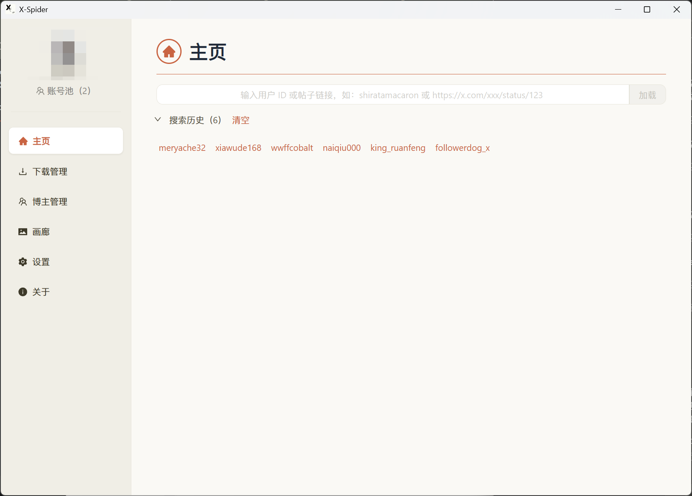
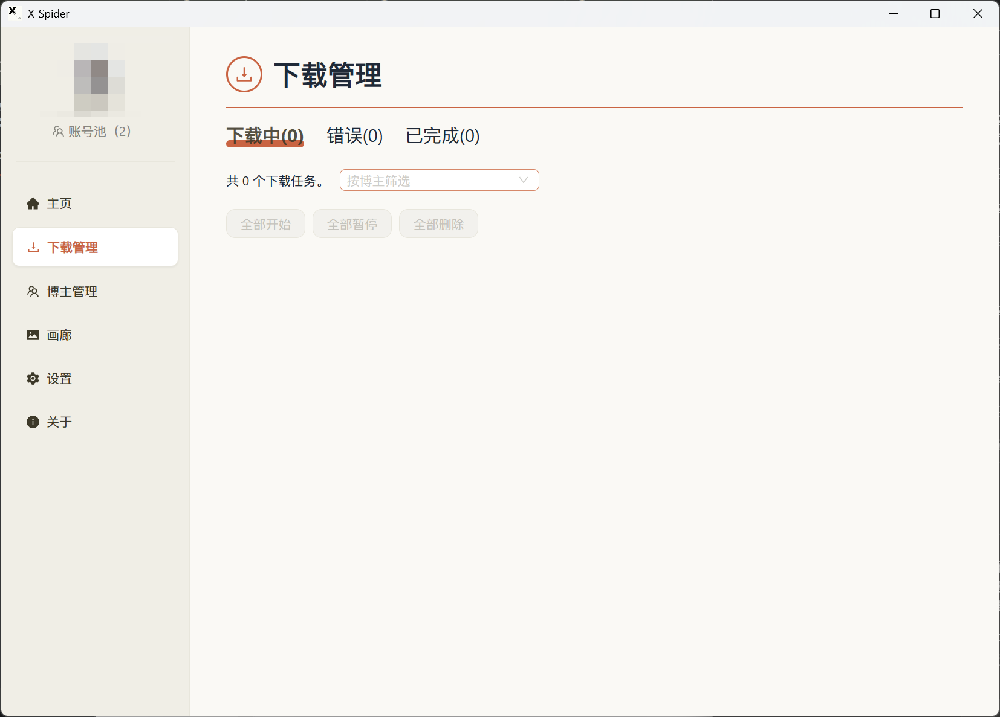
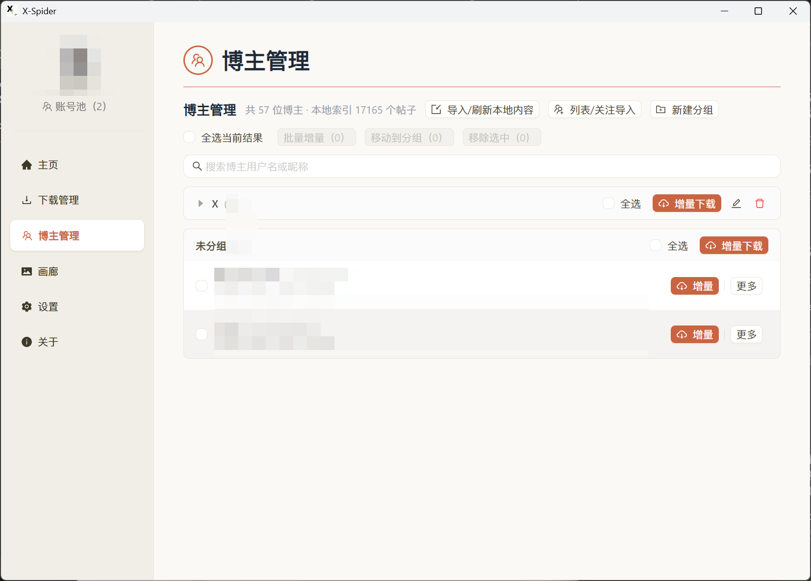
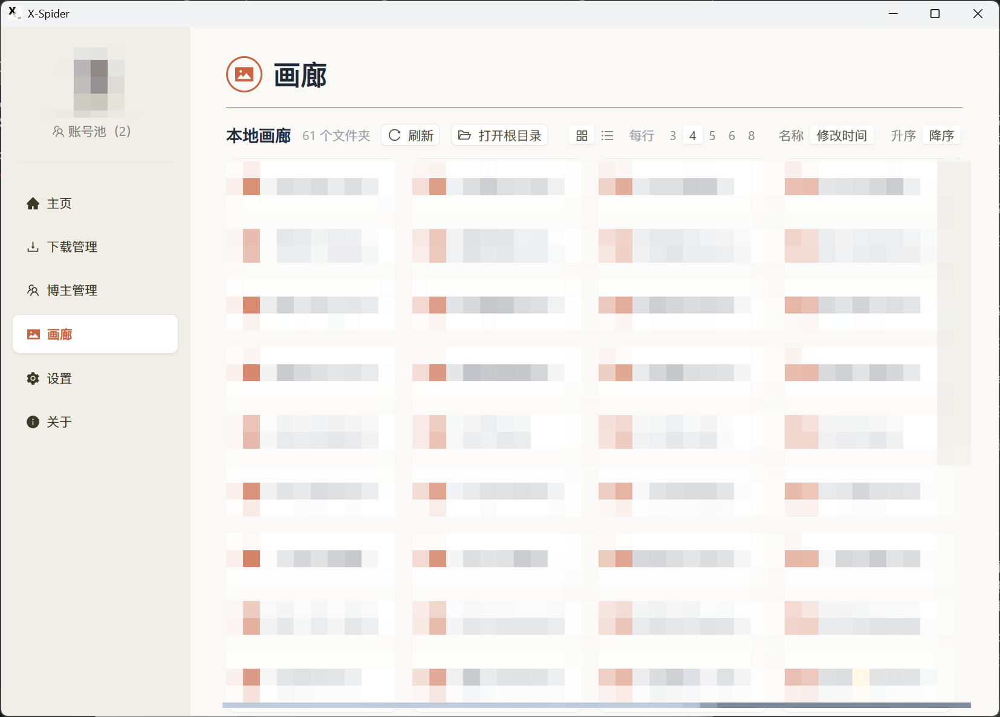
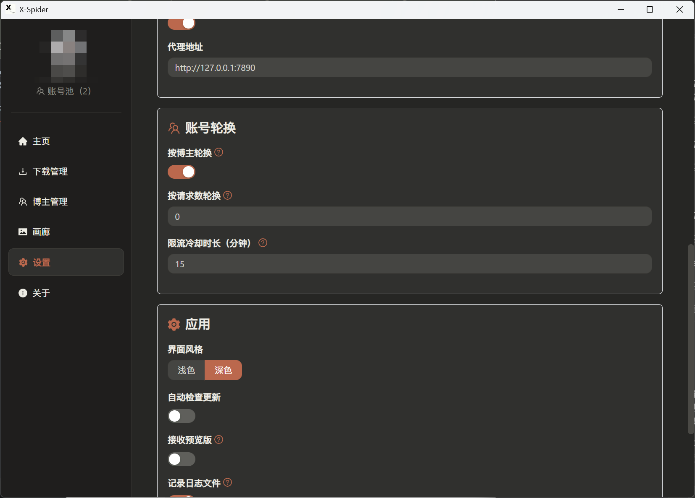

<h1 align="center">X-Spider</h1>

一个功能强大的推特媒体下载器，支持批量管理、智能去重、增量下载

---

## ✨ 核心特色

### 🔄 账号池轮换机制
- 支持配置多个 Cookie 账号
- 自动轮换使用，绕过单账号请求限制
- 智能检测账号状态，失效自动切换
- 未配置 Cookie 时自动启用「游客模式」，无需登录即可下载公开内容

### 📂 智能文件管理
- **文件名匹配去重**：下载前自动扫描本地已有文件，精准识别已下载内容
- **增量下载**：记录每个博主的上次下载时间，一键从上次位置继续
- **自动跳过**：检测到若干已存在文件后自动跳过该博主，节省时间
- **自定义命名**：支持自定义文件名格式和保存路径

### 🖼️ 本地画廊
- **左右分栏**：左侧是可搜索的博主/文件夹列表（显示头像、媒体数量，可按博主分组折叠），右侧直接展示内容，切换博主无需来回返回
- **多级子目录浏览**：子目录以文件夹卡片展示，逐级进入、面包屑返回，不与本层文件混排
- **筛选与排序**：按 图片/视频 类型筛选、按文件名搜索，按名称/修改时间/大小排序
- **统一预览**：图片与视频共用一个全屏预览层，← → 键切换、Esc 关闭、滚轮缩放、拖拽平移，可直接用默认程序打开或在资源管理器中定位
- **视频首帧缩略图**：视频卡片自动生成首帧预览并显示时长（可关闭）
- 网格/列表视图切换，每行 3～10 列自由调节，滚动到底自动加载
- 打开文件夹时自动检测目录变化并重新扫描，新下载的内容即时可见

### 👥 博主分组管理
- 创建自定义分组，按主题、类型等分类博主
- **按分组全选下载**：精准选中当前分组内的博主，不会误选其他分组
- 分组与「未分组」均可折叠收起，列表更清爽
- 批量导入/导出博主列表
- 搜索博主、按分组筛选

### 🎯 灵活下载控制
- 单条推文解析：直接粘贴推文链接快速下载
- **高级搜索下载**：支持 X 搜索语法（from: / filter:media / since: 等），日期范围超过一个月自动按月拆分，避免 X 搜索丢结果
- **我的喜欢 / 我的书签下载**：一键下载登录账号点过喜欢或收藏的推文媒体
- 日期范围过滤：指定下载时间段的内容
- 媒体类型过滤：仅下载图片或视频
- 批量操作：移动分组、删除博主
- **导入导出**：博主列表导出 TXT/CSV、粘贴用户名列表导入；下载记录导出 CSV/JSON

### 🎨 现代化界面
- Claude 风格设计，简洁易用
- 深色/浅色主题切换
- 实时下载进度显示

---

## 📸 软件截图

### 主页 - 搜索历史

### 下载管理

### 博主管理 - 分组功能

### 本地画廊

### 设置页面

---

## 📥 下载

前往 [Releases](https://github.com/obihs2501/x-spider-mod-2026/releases/latest) 下载最新版本

---

## 🚀 快速开始

1. 下载并解压程序
2. 首次运行：
   - （可选）在设置中配置 Cookie 以解锁更多功能
   - 或直接使用游客模式下载公开内容
3. 在主页输入博主 ID 或推文链接
4. 切换到「博主管理」批量添加、分组管理
5. 点击「增量下载」开始批量下载

---

## 🔧 高级功能

### 代理配置
- 支持手动/自动代理设置
- 可配置请求数转换阈值
- 限流冷却时长调整

### 日志记录
- 可选启用日志文件
- 详细记录下载过程和错误信息

---

## 📝 维护状态

因原作者停止维护，本项目现已由新维护者接手。

**开发模式**：自即日起，所有功能更新与维护工作均由 AI 辅助执行。

AI 辅助开发旨在快速响应需求，可能在部分细节上与纯人工开发有所不同，敬请谅解。我们将致力于保持软件的持续更新与稳定，感谢大家的理解与陪伴。

---

## 📄 开源协议

本项目遵循原项目的开源协议。
